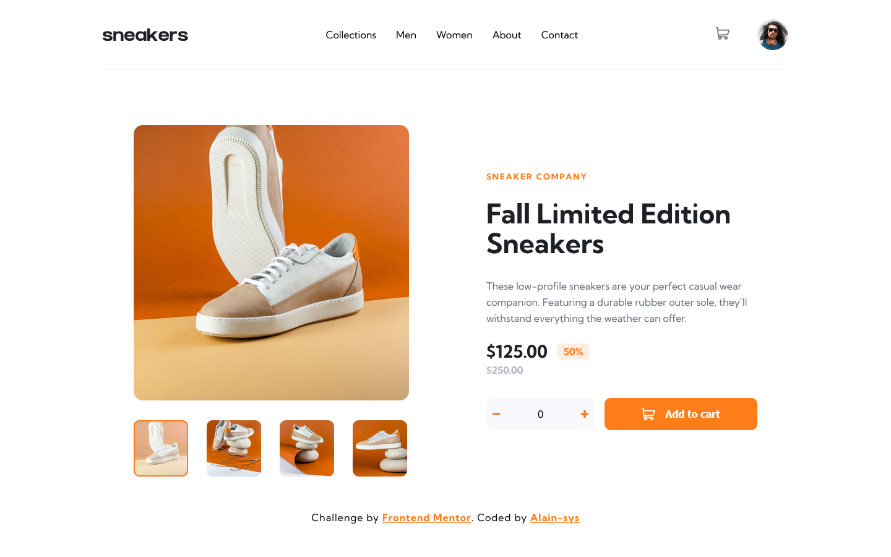
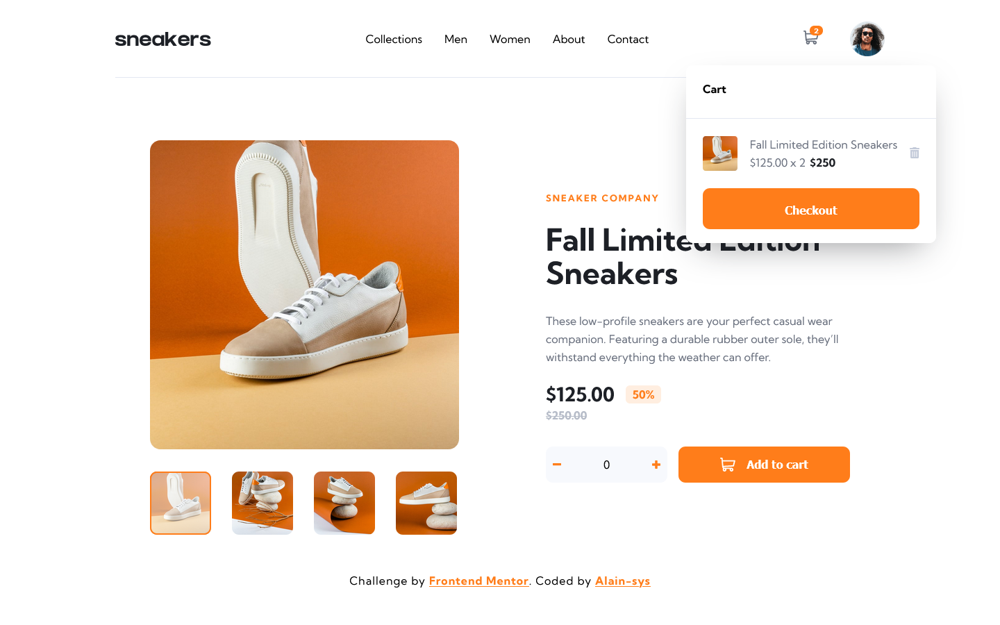
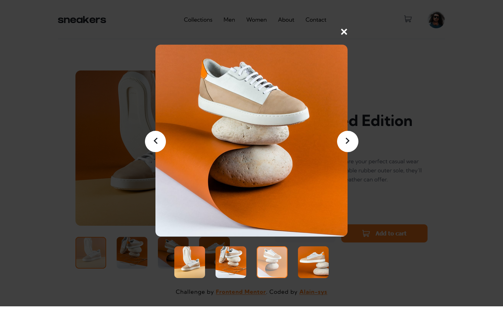
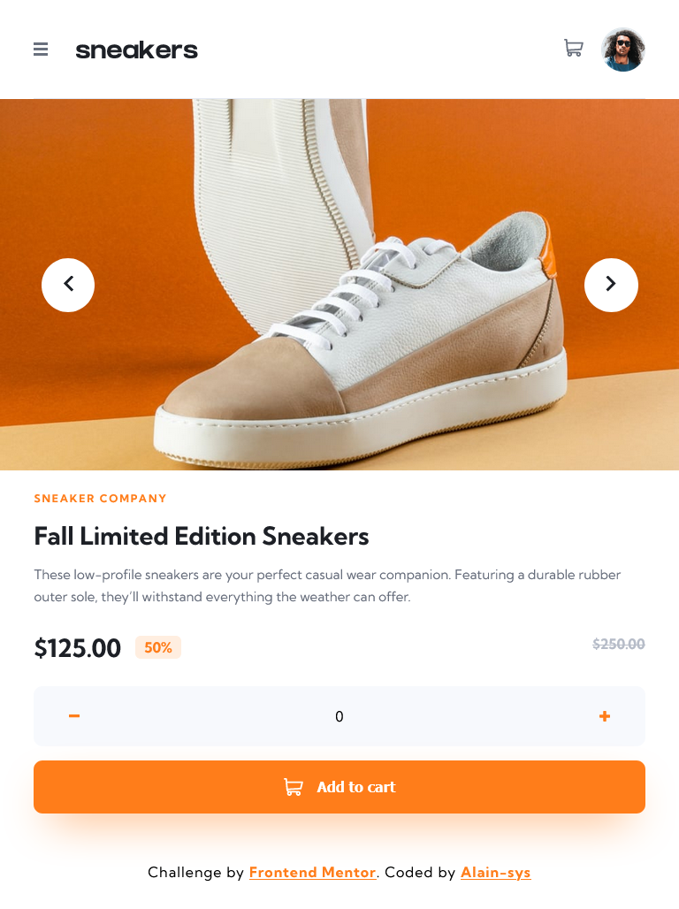
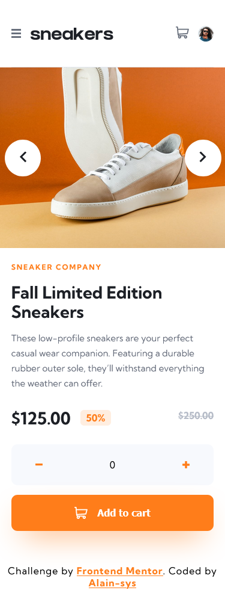
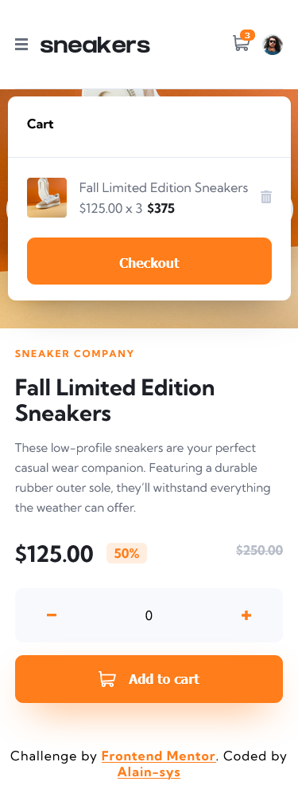
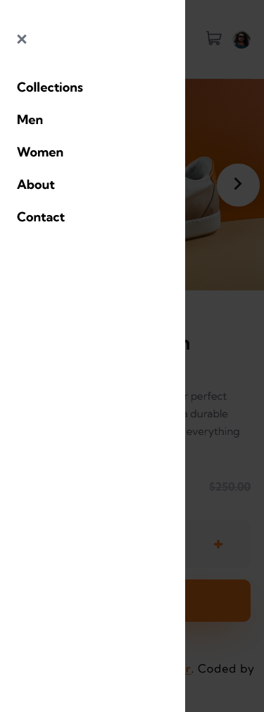

# Frontend Mentor - E-commerce product page solution

This is a solution to the [E-commerce product page challenge on Frontend Mentor](https://www.frontendmentor.io/challenges/ecommerce-product-page-UPsZ9MJp6) coded by [Alain-sys](https://github.com/Alain-sys)

## Table of contents

- [Overview](#overview)
  - [The challenge](#the-challenge)
  - [Screenshot](#screenshot)
  - [Links](#links)
- [My process](#my-process)
  - [Built with](#built-with)
  - [What I learned](#what-i-learned)
  - [Continued development](#continued-development)
  - [Useful resources](#useful-resources)
- [Author](#author)

## Overview

### The challenge

Users should be able to:

- View the optimal layout for the site depending on their device's screen size
- See hover states for all interactive elements on the page
- Open a lightbox gallery by clicking on the large product image
- Switch the large product image by clicking on the small thumbnail images
- Add items to the cart
- View the cart and remove items from it

### Screenshot

 

Desktop

  
  
  

Tablet

  

    
  

  
Mobile

  

    
    
    
  

</details

### Links

- [Live Site URL](https://alain-sys.github.io/e-commerce-product-page/)
- [Solution URL](https://www.frontendmentor.io/solutions/ecommerce-product-page-using-react-_xQejDA_RQ)

## My process

### Built with

- [React](https://reactjs.org/) - JS library

### What I learned

I've reinforced my knowledges in React.

### Continued development

I'm going to learn how to use an API in a little project.

### Useful resources

- [React](https://beta.reactjs.org/learn)
- [MDN](https://developer.mozilla.org/fr/)
- [Stackoverflow](https://stackoverflow.com/)

## Author

- Frontend Mentor - [@Alain-sys](https://www.frontendmentor.io/profile/Alain-sys)
- Twitter - [@Alain_sys](https://twitter.com/Alain_sys)
